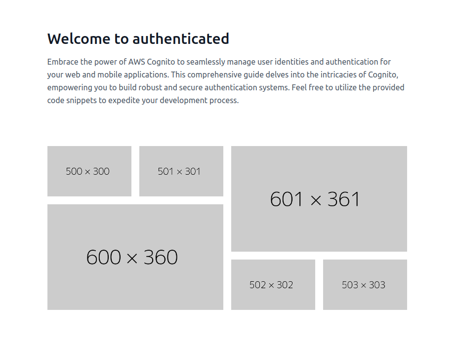

# Full React + Tailwind Authentication (Firebase)

This comprehensive authentication system provides a robust foundation for managing user identities and authentication in your React applications. Feel free to reuse or learn from the provided code to streamline your development process.

## Overview

Leverage the power of Firebase to seamlessly integrate user authentication into your React applications. This project encompasses a complete authentication system, covering user registration, sign-in, email verification, and access-controlled pages.




## Requirements

- Firebase project
- Node.js `v18` or higher
- Yarn

## Running

- Clone the repository:

```bash
git clone <url>
```

- Navigate to the project directory: cd react-tailwind-firebase

```bash
cd react-tailwind-firebase
```

- Install dependencies: yarn

```bash
yarn
```

- Start the development server: yarn start

```bash
yarn start
```

## Tech Stack

- Firebase for user authentication and management
- React for building user interfaces
- React Router for managing application routes
- Tailwind CSS for rapid and responsive styling

## Additional Notes

Feel free to customize the code to suit your specific application needs.
For detailed instructions and configuration guidance, refer to the project's documentation.
